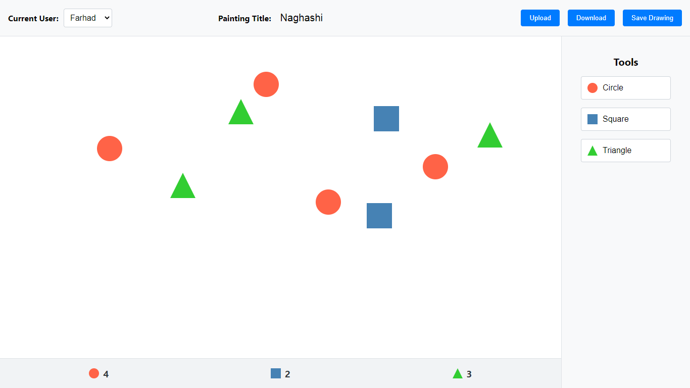

# گزارشی از اجزای اصلی و روند انجام تمرین سوم برنامه‌سازی وب

در این تمرین به ساخت بخش backend مربوط به  برنامه ترسیم نقاشی ساخته‌شده پرداختیم. جزئیات بخش‌های مختلف برنامه در زیر می‌آید.

## ۱. مدل

از دو مدل در برنامه استفاده شده است؛ مدل مربوط به کاربران و نقاشی‌ها. مطابق توضیحات تمرین ارتباط یک‌به‌یک بین این دو مدل برقرار است. برای سادگی در بازیابی داده‌ها این ارتباط در هر دو مدل نشان داده شده است. هم‌چنین از lombok برای تولید setterها و getterها و constructorها استفاده شده است.

## ۲. ریپازیتوری و DTO

کلاس‌های ریپازیتوری مربوط به مدل‌ها بسیار ساده است و از همان تابع‌های آماده‌ای که JPA در اختیار ما قرار می‌دهد استفاده شده است.

یک DTO برای نقاشی ساخته شده است که تنها شامل نام نقاشی و محتوای بوم است و زمانی که کاربر قصد ذخیره‌ی نقاشی‌ای را داشته باشد از آن استفاده می‌شود.

## ۳. سرویس

در سرویس مربوط به کاربران تنها یک تابع قرار دارد که لیست تمامی کاربران را از پایگاه داده دریافت می‌کند و آن را برمی‌گرداند. سرویس مربوط به نقاشی‌ها پیچیده‌تر است و در یک تابع با دریافت نام کاربری نقاشی فرد فرستاده می‌شود. در تابعی دیگر با دریافت نام کاربری و نام و محتوای بوم، نقاشی فرد مورد نظر به‌روزرسانی می‌شود. این توابع به صورت یک تراکنش تعریف شده‌اند تا در صورت رخ دادن هرگونه خطایی تغییری در حالت پایگاه داده داده نشود.

### ۳-۱. مدیریت خطا

برای مدیریت خطا exception مخصوصی برای یافت نشدن داده‌ی مورد نظر ساخته شده است که با کد ۴۰۴ فرستاده می‌شود. هم‌چنین برای مدیریت خطاها در کل برنامه کلاس RestExceptionHandler به شکل ControllerAdvice شده است که خطاها را به شکل مطلوبی می‌سازد. برای خطاهای مربوط به یافت نشدن داده‌ای از کلاسی که پیش از این ذکر شد و برای دیگر انواع خطا از خود کلاس Exception جاوا استفاده می‌شود. استفاده از این خطاها را در DrawingService می‌توان دید.

## ۴. کنترلر

یک کنترلر مربوط به کاربران و یکی مربوط به نقاشی‌ها داریم. در هر کنرلر مشخص شده است که به درخواست‌های از سمت frontend، با آدرس آی‌پی و پورت مشخص، پاسخ دهد. در کنترلر مربوط به نقاشی با درخواست GET یا POST به /api/drawings/{username} می‌توان نقاشی‌ای را دریافت یا ذخیره کرد. با /api/users نیز می‌توان فهرست کاربرها را از کنترلر مربوط به کاربران دریافت کرد.

## ۵. پایگاه داده

در این تمرین به منظور سادگی از پایگاه داده‌ی H2 استفاده شده است. هم‌چنین همان‌طور که در فایل application.properties می‌توان مشاهده کرد تنظیمات آن به گونه‌ای انجام شده است که اطلاعات در فایلی ذخیره شوند و داده‌ها با توقف اجرای backend از دست نروند.

طبق توضیحات فایل تمرین، باید کاربرانی را به طور پیش‌فرض وارد سیستم می‌کرده‌ایم. کلاس DataLoader به همین منظور نوشته شده است که از CommandLineRunner استفاده می‌کند و در ابتدای اجرای برنامه با بررسی خالی بودن پایگاه داده کاربرانی را در آن وارد می‌کند.

## ۶. تغییرات frontend

بیشتر تغییرات در Header رخ داده است. امکان انتخاب بین کاربران موجود و ذخیره‌ی نقاشی اضافه شده است. با این حال هم‌چنان امکان بارگیری و بارگذاری نقاشی وجود دارد.

هم‌چنین فایل api.ts اضافه شده است که وظیفه‌ی برقراری ارتباط با backend، دریافت اطلاعات و برگرداندن آن‌ها را برعهده دارد و به ازای هر تابع در کنترلرها در backend یک تابع در این فایل وجود دارد. روند برنامه به این صورت است که ابتدا برای دریافت لیست کاربران ارتباط برقرار می‌شود. سپس برای هر کاربری که انتخاب شود، نقاشی مربوط به آن دریافت می‌شود. در صورت ذخیره‌سازی نیز این نقاشی به backend فرستاده می‌شود.

تغییرات جزئی‌ای در دیگر فایل‌ها نیز وجود دارد که در این‌جا به آن‌ها نمی‌پردازیم.

## ۷. استفاده از ابزارهای هوش مصنوعی

همچنان از این ابزارها برای تولید استایل جدید برای کامپوننت‌ها استفاده شد. هم‌چنین برای مشخص کردن ساختار کلی backend و مشخص کردن تصمیمات پیش رو و مزایا و معایب آن‌ها نیز از آن‌ها استفاده شد.

از نکات مثبت این استفاده‌ها می‌توان به بررسی جنبه‌های تصمیمات مختلف اشاره کرد؛ برای مثال زمانی که بین دو تصمیم برای ساختار و یا پیاده‌سازی شک وجود دارد. هم‌چنین جدا از سریع‌تر شدن توسعه‌ی کد، عیب‌یابی برنامه نیز ساده‌تر می‌شود. با توجه به کیفیت بالای کدهای تولیدی این ابزارها نیز، استفاده از آن‌ها بار آموزشی خوبی دارد.

از نکات منفی نیز می‌توان به این اشاره کرد که در صورت تکیه‌ی بیش از حد به این ابزارها و آشنا نبودن با موضوع مورد بحث، ممکن است تصمیماتی توسط آن‌ها گرفته شود که در حالت عادی تصمیم مناسبی نمی‌بوده است؛ برای مثال ساده یا پیچیده‌سازی بیش از حد موردی، در صورتی که می‌توانسته است معماری دیگری داشته باشد و یا به‌گونه‌ای دیگر پیاده‌سازی شود.

## ۸. جمع‌بندی

در این گزارش سعی شد با جلوگیری از پرداختن به جزئیات، درباره‌ی بخش‌های مختلف برنامه و بخش‌های مهم کد صحبت شود. هم‌چنین به قابلیت‌های مختلف برنامه و محل پیاده‌سازی آن‌ها اشاره شد. در زیر تصویری کلی از نسخه‌ی جدید برنامه آورده شده است.

